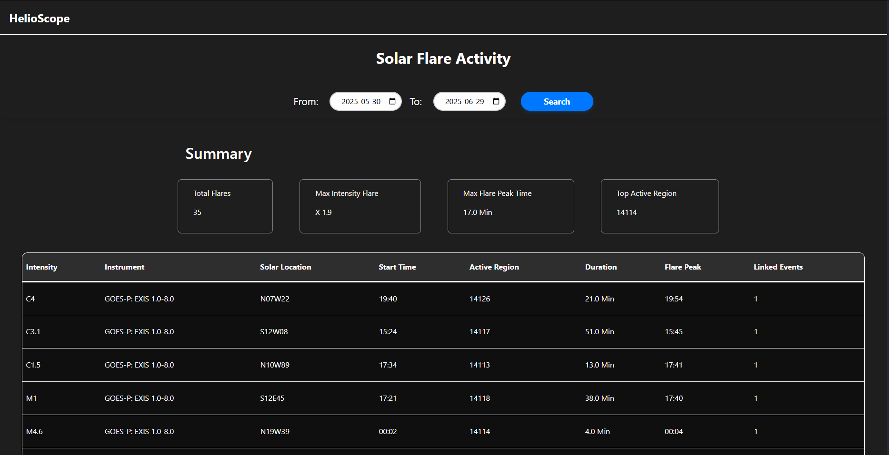

# HelioScope 🌞

**HelioScope** is a modern web application that tracks and visualizes recent solar flare activity using NASA's DONKI API. Built with vanilla JavaScript and styled with a combination of custom CSS and [Bootstrap](https://getbootstrap.com/), this project provides a clean, responsive, and interactive way to explore key solar flare events.

 <!-- Add your screenshot image in your repo root, or update the path -->

---

## 🚀 Features

- **Live Solar Flare Data**: Fetches up-to-date solar flare events from [NASA DONKI API](https://api.nasa.gov/).
- **Date Range Picker**: Easily select a custom date range (default: last 30 days).
- **Summary Dashboard**: Displays total flares, max intensity, peak time, and most active region.
- **Detailed Table**: See all details for each flare, including intensity, instrument, duration, and more.
- **Responsive Design**: Looks great on both desktop and mobile devices.
- **Animated Loader**: Shows a stylish spinner from [CSS Loaders](https://cssloaders.github.io) while fetching data.

---

## 💻 Demo

> **Live Demo:** [View on Vercel](https://helioscope.vercel.app/)  

---

## 🛠️ Tech Stack

- **Frontend:**  
  - HTML5  
  - CSS3 ([Bootstrap](https://getbootstrap.com/) for tables, custom CSS for layout & loader)
  - JavaScript (Vanilla)

- **API:**  
  - [NASA DONKI FLR (Solar Flare) API](https://api.nasa.gov/)

- **Other:**  
  - [CSS Loader Spinner](https://cssloaders.github.io) for attractive loading animation

---

## 📦 Installation

```bash
git clone https://github.com/yourusername/helioscope.git
cd helioscope
```

You can open `index.html` directly or deploy using [Vercel](https://vercel.com/) or any static host.

---

## 📝 Usage

1. **Open the App:**  
   Visit the deployed site or open `index.html` locally.

2. **Pick a Date Range:**  
   Use the date inputs to select the desired period (max 30 days recommended for performance).

3. **Click "Search":**  
   Watch the loader spinner, then view the summary and flare details table.

4. **Explore Data:**  
   - **Summary:** Total flares, max intensity, top region, etc.
   - **Table:** All individual flare details, sortable and easy to read.

---


## ⚡ Credits

- **Solar Flare Data**: [NASA DONKI API](https://api.nasa.gov/)
- **Table Styling**: [Bootstrap](https://getbootstrap.com/)
- **Loader Spinner**: [CSS Loaders](https://cssloaders.github.io)
- **Fonts**: [Google Fonts: Space Grotesk & Libre Baskerville](https://fonts.google.com/)


---

## 🙌 Contributions

Pull requests and issues are welcome!  
If you have ideas for new features or improvements, feel free to open an issue or PR.

---

## 📬 Contact

Feel free to reach out via [GitHub Issues](https://github.com/yourusername/helioscope/issues) for feedback or questions.

---

> _HelioScope: Visualize the Sun's Flares, beautifully._